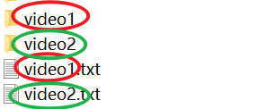
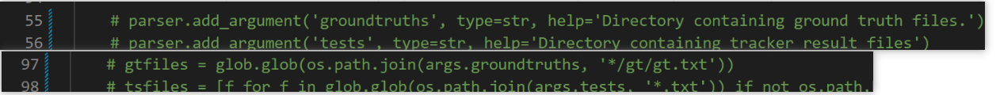
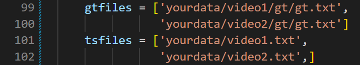
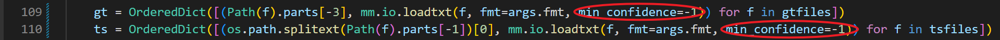
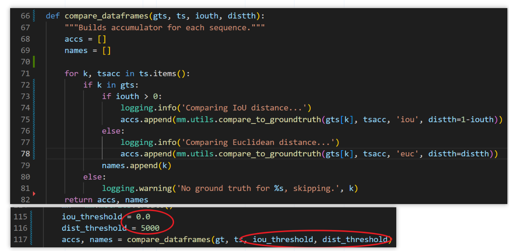
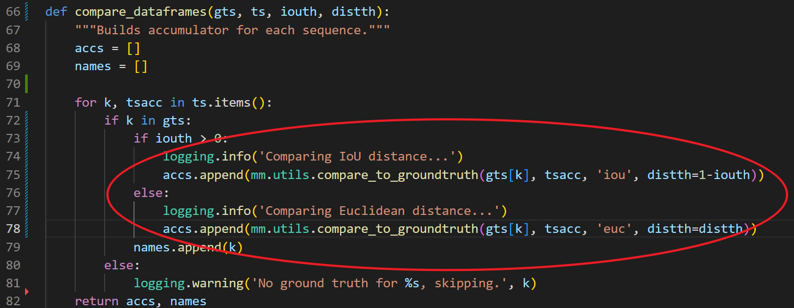
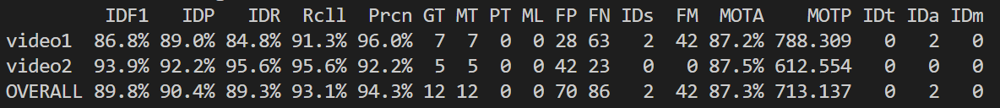

# py-motmetrics modified by ddz

## 背景

鉴于我在知乎上的文章
[MOT多目标跟踪评价指标及计算代码（持续更新）](https://zhuanlan.zhihu.com/p/405983694)
，有很多人在评论区指出跑出来的结果有误，大家可以参照我下面的设置和改动来跑你自己的数据。

## 数据

你可以将你的数据，真实（gt）和测试（test）文件放在`yourdata/`文件夹下，这是一个例子：

你现在有两个视频，video1和video2，这两个视频你都进行了多目标跟踪。那么你需要这样组织你的文件夹：
```
--video1/gt/gt.txt          # video1的gt文件
--video2/gt/gt.txt          # video2的gt文件
--video1.txt                # video1的test文件
--video2.txt                # video2的test文件
```
像这样：


注意，红圈里要一致，绿圈里也要一致。

你可以看我这个库里的yourdata文件夹，照葫芦画瓢即可。假如你有很多个视频需要测，同样地组织你的文件夹就行。

**至于每个文件中的格式，直接参照我的就行，比如：**
```
10,1,660,2116,28,63,-1,-1,-1,-1
10,2,101,3247,37,61,-1,-1,-1,-1
10,3,68,517,23,40,-1,-1,-1,-1
...
```
**每行的第一个数是帧号；第二个数是id；后面接着的四个数表示框的位置和大小；然后倒数第四个数是置信度，我这里设置为-1是因为我的跟踪方法根本不输出置信度，如果是你用的跟踪方法输出置信度，则你需要把这个数设为置信度；最后三个数不重要不用管。**
## 代码改动

相比于原始的py-motmetrics库，我只改动了以下几个地方，均是在`motmetrics/apps/eval_motchallenge.py`文件中。

### 第一个地方
我把55、56、97、98行的代码（关于数据集）注释掉了：



我又在99-102行加了我自己的数据集路径，也就是yourdata下面的gt和test：



这样做的目的是，直接写死路径，不用给出数据集的路径参数。

### 第二个地方
第109和110行代码中，我添加了min_confidence参数并设置为-1，如下：



这是什么意思呢？**min_confidence参数的意思是，在进行评估时，只考虑置信度在min_confidence以上的那些跟踪框**。而对于我自己的数据，我的跟踪算法根本不输出置信度，我test文件中的置信度都是-1，所以我把min_confidence参数都设置为了-1。很多人可能是这里出的问题。**你可以根据你自己的跟踪算法究竟考不考虑置信度来设置这个min_confidence参数。**

### 第三个地方
第66-82代码中我改动了compare_dataframes函数，在115-117行中我定义了iou的阈值参数和dist（距离）的阈值参数，并将它们传给compare_dataframes函数，如下：



这是什么意思呢？**实际上，我们在评估mot指标时，我们会匹配真实框和跟踪框，也就是说，我们会根据iou或者距离来匹配。比如，对于一个真实框和一个跟踪框，它们的iou大于某个阈值，才能匹配成功，算是跟踪成功了，或者我们定义它们的dist（距离）小于某个阈值，才能匹配成功。**

由于我的数据比较特殊，如果只看iou的话，很难匹配上。所以我只看框的中心点的距离，但我的数据范围又非常大，所以我将距离阈值设很大（5000）。

**如果你自己想用，你可以根据你自己数据的特性来更改这两个阈值，以及compare_dataframes函数里的逻辑（红圈中的代码）：**



## 运行和结果

运行：
```
python motmetrics/apps/eval_motchallenge.py
```
即可得到：



各项指标都正常。